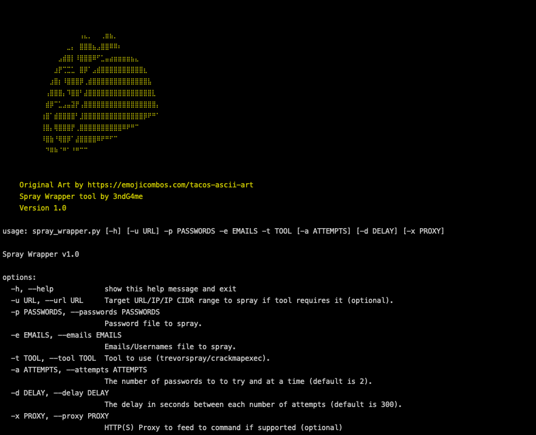

# Spray Wrapper
Wrapper for spray tools that are awesome, but can't count/delay to save their lives

  

## About
Spray Wrapper v1.0

This is just a simple modular wrapper to help cleanly integrate a proper delay and iteration cycle over common password spraying tools that don't support it.

Currently this supports the following tools:
- `trevorspray`: https://github.com/blacklanternsecurity/TREVORspray
- `crackmapexec`: https://github.com/Porchetta-Industries/CrackMapExec

## Usage

  

1. Install dependencies with `pip install -r requirements.txt`
2. The `spray_wrapper.py` program takes in a target URL that can be a domain/IP/CIDR or any other similar data to feed to a module. It requires this target, a password file, an username/email file, and the tool you wish to use.
3. You can then specify a delay amount in seconds and how many passwords to try within that delay.
4. Lastly you can provide a proxy if the module supports it.
5. Example command using `trevorspray` that will try 3 passwords every 500 seconds and proxy the request through a local proxy on port 8080:
    -  `python3 ~/tools/spray_wrapper/spray_wrapper.py -u https://login.windows.net/<sometoken>/oauth2/token -p passwords.txt -e emails.txt -t trevorspray -a 3 -d 500 -x http://127.0.0.1:8080`

### Modules
You can create new modules by adding them to the modules folder. Feel free to PR new modules, if they work and are relevant we'll add them in!

To create a module:
1. Add the module to the `__init__.py` list by name.
2. Create the module file, make the function name, it can do anything you want, but it'll receive data from the main program!
3. Add a check for it in the primary `spray_wrapper.py` file to execute your new module.
4. In this check add a call to the new function in your module and pass it the data it needs. 
